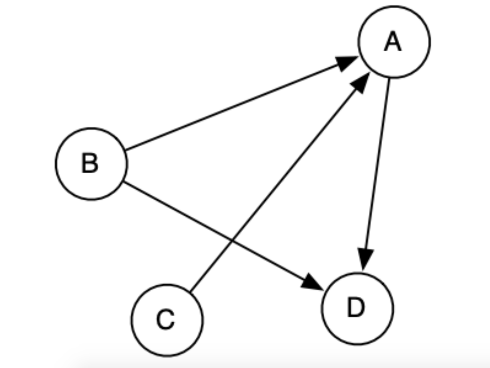
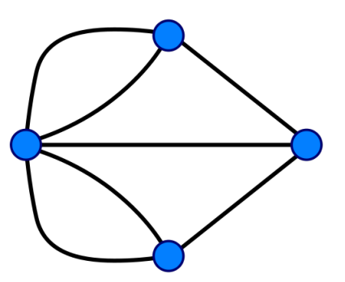
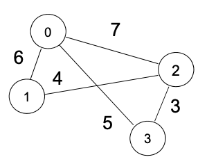
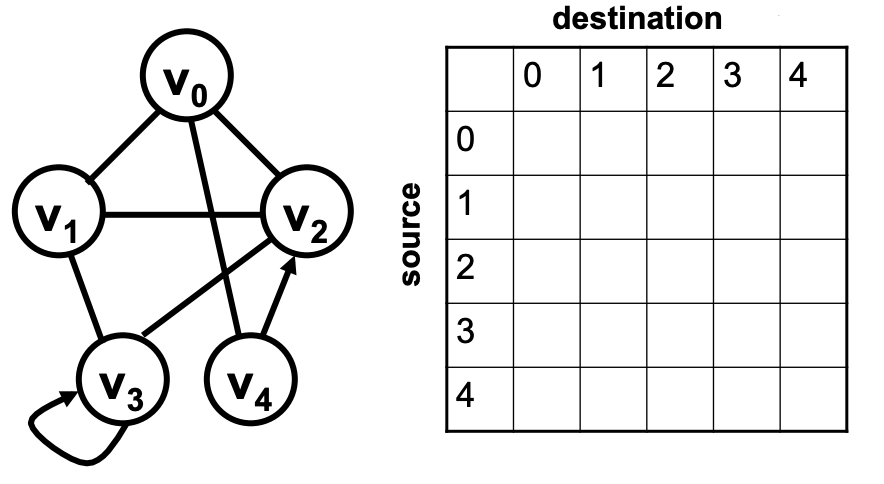
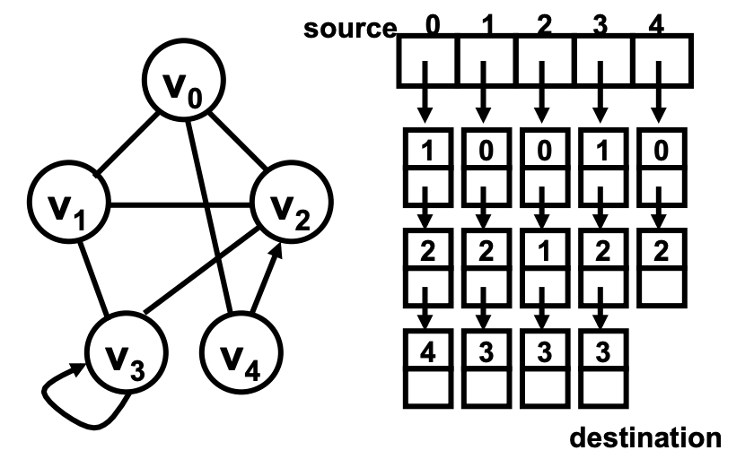

## 图的应用

* 社交网络。社交网络是典型的网络结构，图可以用点来表达社交关系中的人，用点与点之间的连接来表达人与人的关系
* 交通网络。交通网络也可以用图来表达。比如所有的城市可以用图的节点来表示，城市间的交通渠道可以用边来表示。
* 互联网网站连接。我们经常看到网站上会有指向其他网址的超链接。如果我们把互联网所有的网页定义成图的节点，那么网页与网页之间的边就是这些链接了

## 图的定义、图的方向和权重

> 从数学规范上来讲一个图可以被定义成一个集合 G， G = (V,A) ，其中：
> 
> * V 是图的节点集合
> * A ⊆ V × V 是节点与节点之间的连接的边，边可以是有向或者是无向的
> 
> 栗子：
>
> * 有向图示例
> 
> * 无向图示例
> 
> * 有权重的图示例
> 
>

## 图的实现和内存表达

### 邻接矩阵法

> 邻接矩阵法可以更快地添加和删除边，也可以更快地判断边是否存在,但是邻接矩阵法需要一个 O(V^2) 的内存空间，相对来说更适合边比较多的图，
> 这样就可以更好的利用这些内存。因为邻接矩阵法存储的是边，不管有多少边，它都需要一样的内存。

### 邻接链表法

> 邻接链表法可以更快地操作一个节点相邻的节点，在一个稀疏的图中也就是边比较少的图中，邻接链表法的效率其实是比较高的。因为每一个单链表都比较短，
> 我们知道修改链表的时间复杂度是 O(n)，同样也适用于邻接链表法。如果邻接链表法的边比较多，则链表就会比较长，进而影响我们的操作效率。邻接链表法的空间复杂度需要 O(|V| + |E|) 的内存空间。

