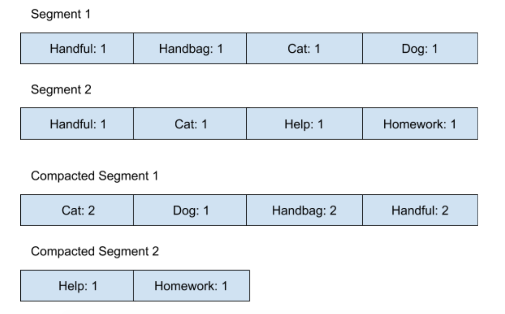

## 树的定义

* 一个节点的深度是从根节点到自己边的数量, 比如 K 的深度是 2。
* 节点的高度是从最深的节点开始到自己边的数量, 比如 B 的高度是 2。一棵树的高度也就是它根节点的高度
* 树的递归定义是： n（n>=0）个节点的有限集合，其中每个节点都包含了一个值，并由边指向别的节点（子节点），边不能被重复，并且没有节点能指向根节点。广义的树中，节点可以有 0 个或者多个子节点。
* 广义的树可以用来表达有层次结构的数据关系，比如文件系统（File System）是一个有层次关系的集合，文件系统中每一个目录（Directory）可以包含多个目录，没有子目录的叶子节点也就是文件（File）了。

## 二叉查找树 （BST）

   

* 二叉查找树是一棵二叉树，也就是说每一个节点至多有 2 个孩子，也就是 2 个子树。
* 二叉查找树的任意一个节点都比它的左子树所有节点大，同时比右子树所有节点小。

## 平衡树

> 平衡树，就是说一棵树的数据结构能够维护好自己的高度和形状，让形状保持平衡的同时，高度也会得到控制

### 红黑树

* 一棵二叉树，每一个节点要么是红色，要么是黑色
* 根节点一定是黑色
* 红节点不能有红孩子
* 每条从根节点到底部的路径都经过同样数量的黑节点

### B 树

> B 数的每个节点可以存储多个值

* 所有叶子节点的深度一样
* 非叶子节点只能存储 b － 1 到 2b － 1 个值
* 根节点最多存储 2b － 1 个值

## Log-Structured 结构

有时候也会被称作是 Append-only Sequence of Data，因为所有的写操作都会不停地添加进这个数据结构中，而不会更新原来已有的值，这也是 Log-Structured 结构的一大特性。

### Log-Structured 结构的优化

> 首先，可以定义一个大小为 N 的固定数组，我们称它为 Segment，一个Segment最多可以存储N个数据，当有第N+1个数据需要写入Log-Structured结构的时候，我们会创建一个新的Segment，然后将N+1个数据写入到新的Segment中。
>
> 我们定义当Segment的数量到达 N 个的时候，后台线程就会执行Compaction来合并结果 
>
> 删除 Segment1...SegmentN腾出空间

## SSTable和LSM树

* SSTable（Sorted String Table）数据结构是在 Log-Structured 结构的基础上，多加了一条规则，就是所有保存在 Log-Structured 结构里的数据都是键值对，并且键必须是字符串，
在经过了Compaction操作之后，所有的Compacted Segment 里保存的键值对都必须按照字符排序。

* LSM 树（Log-Structured Merge-Tree）是通过内部维护平衡树来进行Log-Structured结构的Compaction优化的一种数据结构

