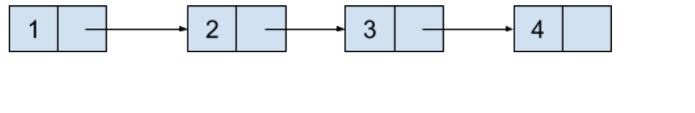

## 链表

> 不保存在连续存储空间中，而每一个元素里都保存了到下一个元素的地址的数据结构，称之为链表，
> 链表上的每一个元素又可以称它为节点（Node），而链表中第一个元素，称它为头节点（Head Node），最后一个元素称它为尾节点（Tail Node）。
> 
>

## 数组与链表的性能差异

### 空间利用率

* 数组的空间利用率相当于本来需要的大小除以创建出来数组的大小
* 链表的空间利用率上相当于值的大小除以值的大小和节点地址大小的和

### 时间复杂度

* 访问元素
    * 访问数组元素的时间复杂度是 O(1)。而因为链表顺序访问的这个特性，
    * 访问链表中第 N 个元素需要从第一个元素一直遍历到第 N 个元素，所以平均下来的时间复杂度是 O(N)。
* 插入操作
    * 插入操作无论是发生在数组结尾还是发生在数组的中间，因为都需要重新创建一个新的数组出来，并复制一遍之前的元素到新的数组中，所以平均的时间复杂度都是 O(N)
    * 对于链表来说，要是我们一直都能维护一个尾节点的地址的话，那么插入一个新的元素只需要 O(1) 的时间复杂度。而当插入一个元素到链表中间的时候，因为链表顺序访问的这个特性，我们需要先遍历一遍链表，从第一个节点开始直到第 N 个位置，然后再进行插入，所以平均下来的时间复杂度是 O(N)。

## 链表的各种形式

### 单向链表

> 在一个节点中既保存了我们需要的数据，也保存了指向下一个节点地址信息的链表，称之为单向链表（Singly Linked List）。
> 抽象的数据图就如下图所示：
> 

### 双向链表

> 单向链表有着只能朝着一个方向遍历的局限性，既然我们可以保存指向下一个节点地址的信息，也可以保存指向上一个节点地址的信息。
> 这种在一个节点中保存了我们需要的数据也保存了连向下一个和上一个节点地址信息的链表，称之为双向链表（Doubly Linked List）。
> 和链表中尾节点的下一个节点只保存空地址一样，链表中头节点的上一个节点地址也保存着空地址，
> 抽象的数据图就如下图所示：
> 

### 循环链表

> 无论是单向链表或者是双向链表，当我们遍历至尾节点之后就无法再遍历下去了，
> 如果将尾节点指向下一个节点地址的信息更新成指向头节点的话，这样整个链表就形成了一个环，这种链表称之为循环链表（Circular Linked List）。
> 抽象的数据图就如下图所示：
> 

