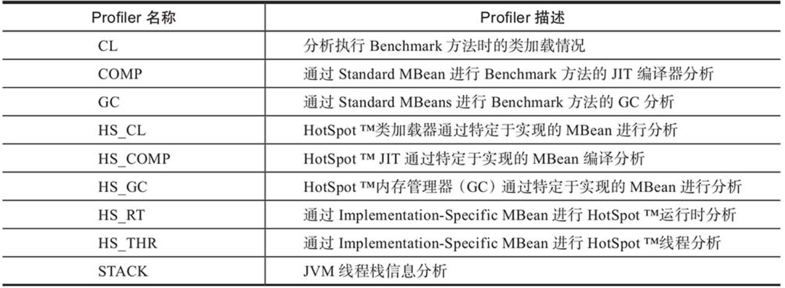

## JMH 的 Profiler

### StackProfiler

> StackProfiler不仅可以输出线程堆栈的信息，还能统计程序在执行的过程中线程状态的数据，比如RUNNING状态、WAIT状态所占用的百分比等
>
> [代码清单](https://github.com/fxbin/myself-wiki/tree/master/code-modules/basic-knowledge/src/main/java/cn/fxbin/record/basic/jmh/JMHExample21.java)     

### GcProfiler

> GcProfiler可用于分析出在测试方法中垃圾回收器在JVM每个内存空间上所花费的时间
>
> [代码清单](https://github.com/fxbin/myself-wiki/tree/master/code-modules/basic-knowledge/src/main/java/cn/fxbin/record/basic/jmh/JMHExample22.java)    

### ClassLoaderProfiler

> ClassLoaderProfiler可以帮助我们看到在基准方法的执行过程中有多少类被加载和卸载，但是考虑到在一个类加载器中同一个类只会被加载一次的情况，因此我们需要将Warmup设置为0，以避免在热身阶段就已经加载了基准测试方法所需的所有类。
>
> [代码清单](https://github.com/fxbin/myself-wiki/tree/master/code-modules/basic-knowledge/src/main/java/cn/fxbin/record/basic/jmh/JMHExample23.java)    

### CompilerProfiler

> CompilerProfiler将会告诉你在代码的执行过程中JIT编译器所花费的优化时间
> 可以打开verbose模式观察更详细的输出
>
> [代码清单](https://github.com/fxbin/myself-wiki/tree/master/code-modules/basic-knowledge/src/main/java/cn/fxbin/record/basic/jmh/JMHExample24.java)   
