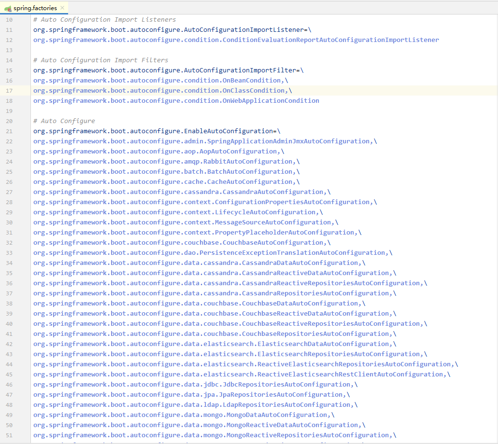

## SPI 机制

### SPI 是什么

* SPI ，全称为 Service Provider Interface，是一种服务发现机制。它通过在ClassPath路径下的META-INF/services文件夹查找文件，自动加载文件里所定义的类。
  这一机制为很多框架扩展提供了可能，比如在JDBC、SpringBoot、Dubbo中都使用到了SPI机制。
  
### SPI思想

* SPI的全名为Service Provider Interface.这个是针对厂商或者插件的。
* SPI的思想：系统里抽象的各个模块，往往有很多不同的实现方案，比如日志模块的方案，xml解析模块、jdbc模块的方案等。
面向的对象的设计里，我们一般推荐模块之间基于接口编程，模块之间不对实现类进行硬编码。一旦代码里涉及具体的实现类，就违反了可拔插的原则，如果需要替换一种实现，就需要修改代码。
为了实现在模块装配的时候能不在程序里动态指明，这就需要一种服务发现机制。java spi就是提供这样的一个机制：为某个接口寻找服务实现的机制

### SPI 约定

* 当服务的提供者，提供了服务接口的一种实现之后，在jar包的META-INF/services/目录里同时创建一个以服务接口命名的文件。该文件里就是实现该服务接口的具体实现类。
而当外部程序装配这个模块的时候，就能通过该jar包META-INF/services/里的配置文件找到具体的实现类名，并装载实例化，完成模块的注入。
通过这个约定，就不需要把服务放在代码中了，通过模块被装配的时候就可以发现服务类了
 
### SPI实现DEMO

`sun.misc.Service` 
`java.util.ServiceLoader`

- [DEMO](src/main/java/cn/fxbin/record/study/spi)

## SPI 案例
 
### JDBC 中的应用
 
* `DriverManager` class
* `loadInitialDrivers` method

[参考](https://www.jianshu.com/p/3a3edbcd8f24)

### SpringBoot 中的类 SPI 扩展机制

* 在springboot的自动装配过程中，最终会加载META-INF/spring.factories文件，而加载的过程是由SpringFactoriesLoader加载的。
从CLASSPATH下的每个Jar包中搜寻所有META-INF/spring.factories配置文件，然后将解析properties文件，找到指定名称的配置后返回。
需要注意的是，其实这里不仅仅是会去ClassPath路径下查找，会扫描所有路径下的Jar包，只不过这个文件只会在Classpath下的jar包中。



```java

public final class SpringFactoriesLoader {

	/**
	 * The location to look for factories.
	 * <p>Can be present in multiple JAR files.
	 */
	public static final String FACTORIES_RESOURCE_LOCATION = "META-INF/spring.factories";
    // spring.factories 文件格式参见上图

    // ... 省略N    


    // 从所有jar找到 META-INF/spring.factories, 解析出所有的实现类
	/**
	 * Load the fully qualified class names of factory implementations of the
	 * given type from {@value #FACTORIES_RESOURCE_LOCATION}, using the given
	 * class loader.
	 * @param factoryType the interface or abstract class representing the factory
	 * @param classLoader the ClassLoader to use for loading resources; can be
	 * {@code null} to use the default
	 * @throws IllegalArgumentException if an error occurs while loading factory names
	 * @see #loadFactories
	 */
	public static List<String> loadFactoryNames(Class<?> factoryType, @Nullable ClassLoader classLoader) {
		String factoryTypeName = factoryType.getName();
		return loadSpringFactories(classLoader).getOrDefault(factoryTypeName, Collections.emptyList());
	}

	private static Map<String, List<String>> loadSpringFactories(@Nullable ClassLoader classLoader) {
		MultiValueMap<String, String> result = cache.get(classLoader);
		if (result != null) {
			return result;
		}

		try {
            // 取得资源文件的URL
			Enumeration<URL> urls = (classLoader != null ?
					classLoader.getResources(FACTORIES_RESOURCE_LOCATION) :
					ClassLoader.getSystemResources(FACTORIES_RESOURCE_LOCATION));
			result = new LinkedMultiValueMap<>();
			while (urls.hasMoreElements()) {
				URL url = urls.nextElement();
				UrlResource resource = new UrlResource(url);
                // 解析properties
				Properties properties = PropertiesLoaderUtils.loadProperties(resource);
				for (Map.Entry<?, ?> entry : properties.entrySet()) {
					String factoryTypeName = ((String) entry.getKey()).trim();
					for (String factoryImplementationName : StringUtils.commaDelimitedListToStringArray((String) entry.getValue())) {
						result.add(factoryTypeName, factoryImplementationName.trim());
					}
				}
			}
			cache.put(classLoader, result);
			return result;
		}
		catch (IOException ex) {
			throw new IllegalArgumentException("Unable to load factories from location [" +
					FACTORIES_RESOURCE_LOCATION + "]", ex);
		}
	}


    // ... 省略N    

}

```

### Dubbo 中SPI 扩展点

[Dubbo 扩展点加载](http://dubbo.apache.org/zh-cn/docs/dev/SPI.html)
