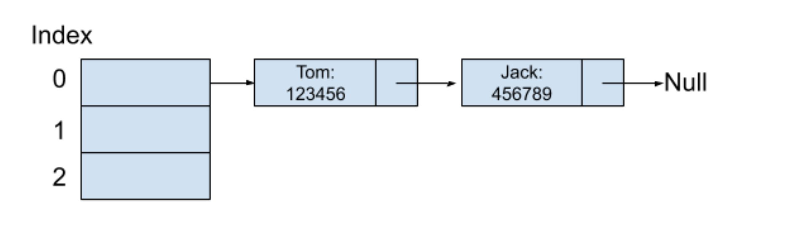
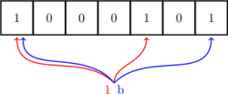

## 哈希表

> 一个根据键（Key）而直接访问在内存中存储位置的值（Value）的数据结构

## 哈希函数

### 定义

> 将任意长度的一个对象映射到一个固定长度的值上，而这个值我们可以称作是哈希值（Hash Value）

### 特征

* 任何对象作为哈希函数的输入都可以得到一个相应的哈希值；
* 两个相同的对象作为哈希函数的输入，它们总会得到一样的哈希值；
* 两个不同的对象作为哈希函数的输入，它们不一定会得到不同的哈希值。

### 应用

#### 加密哈希函数

* 加密哈希函数
    > 一个哈希函数如果能够被安全地应用在密码学中，我们称它为加密哈希函数（Cryptographic Hash Function）
* 常见的加密哈希函数算法
    * [MD（Message Digest）](https://baike.baidu.com/item/MD5/212708) 算法
        > MD 算法可以通过输入产生一个 128 位的哈希值出来，用于确保信息传输的完整性
    * [SHA（Secure Hash Algorithm）](https://baike.baidu.com/item/SHA%E5%AE%B6%E6%97%8F) 算法
        > 在 SHA 算法中，比较常见的有 SHA-1、SHA-256算法等，它们也是可以通过输入而产生一个 160位或者 256位的哈希值出来，
        > 它们与 MD 算法一样，都是用于确保信息传输的完整性 

## 哈希碰撞

### 哈希碰撞的两种解决方式

#### 开放寻址法（Open Addressing）

> 开放寻址法本质上是在数组中寻找一个还未被使用的位置，将新的值插入。
> 这样做的好处是利用数组原本的空间而不用开辟额外的空间来保存值。
>
> 最简单明了的方法就是沿着数组索引，往下一个一个地去寻找还未被使用的空间，这种方法叫做线性探测（Linear Probing）。
> 
> 以上方式会引起哈希聚集问题。如下图： 本不该产生哈希碰撞，依旧需要进行一次线性探测
>  
>
> 平方探测（Quadratic Probing）和二度哈希（Double Hashing）用于缓解哈希聚集
> * 平方探测
>
>  平方探测指的是每次检查空闲位置的步数为平方的倍数。
>  例如，当新元素插入的键所产生的哈希值为i，那下一次的检测位置为：i加上1的平方、i减去1的平方、i加上2的平方、i减去2的平方、…，以此类推。
>
> * 二度哈希
>  
>   二度哈希指的是数据结构底层会保存多个哈希函数，当使用第一个哈希函数算出的哈希值产生了哈希碰撞之后，将会使用第二个哈希函数去运算哈希值，…，以此类推。
>

#### 分离链接法（Separate Chaining）

> 它的本质是将所有的同一哈希值的键值对都保存在一个链表中，而哈希表底层的数组元素就是保存这个哈希值对应的链表。

## Bloom Filter

### 概念

> Bloom Filter 是 一个哈希表和位数组相结合的基于概率的数据结构由Bloom在1970年提出。它主要用于在超大的数据集合中判断一个元素是否存在这个集合中，
> 像判断一个人是否在黑名单中一样，或者判断一封邮件是否属于垃圾邮件的范畴等等。因为使用了位数组，所以使得Bloom Filter在空间利用率上非常的高效。
> 而同时它的底层原理和哈希表一致，使得它在查找的时间复杂度上也十分优秀

> Bloom Filter的原理是将一个元素通过多个哈希函数映射到位数组中

### 举个栗子

下面是一个简单的 Bloom filter 结构，开始时集合内没有元素

当来了一个元素 a，进行判断，这里哈希函数有两个，计算出对应的比特位上为 0 ，即是 a 不在集合内，将 a 添加进去：

之后的元素，要判断是不是在集合内，也是同 a 一样的方法，只有对元素哈希后对应位置上都是 1 才认为这个元素在集合内（虽然这样可能会误判）：

随着元素的插入，Bloom filter 中修改的值变多，出现误判的几率也随之变大，当新来一个元素时，满足其在集合内的条件，即所有对应位都是 1 ，这样就可能有两种情况，一是这个元素就在集合内，没有发生误判；还有一种情况就是发生误判，出现了哈希碰撞，这个元素本不在集合内。

* [该示例说明来源于百度百科](https://baike.baidu.com/item/bloom%20filter/6630926?fr=aladdin)

> 误判率的公式如下

> 

> m 表示位数组里位的个数，n 表示已经存储在集合里的元素个数，k 表示哈希函数的个数

## 均摊时间复杂度

> 哈希表是一个可以根据键来直接访问在内存中存储位置的值的数据结构。虽然哈希表无法对存储在自身的数据进行排序，但是它的插入和删除操作的均摊时间复杂度都属于均摊 O(1) (Amortized O(1))

> * 对均摊时间复杂度的理解： 
>   * 如果说一个数据结构的均摊时间复杂度是 X，那么这个数据结构的时间复杂度在大部分情况下都可以达到 X，只有当在极少数的情况下出现时间复杂度不是 X。
>   * 在处理哈希碰撞的时候，需要花费额外的时间去寻找下一个可用空间，这样造成的时间复杂度并不是 O(1)，
>     哈希表在极端情况下，假设每一个插入的数据都产生了哈希碰撞，我们采用分离链接法来解决哈希碰撞，那么时间复杂度就会变成O(N)， "实际并不会，哈希碰撞是少数"

## 哈希表的应用

### 缓存（Cache）

* Memcached 缓存

> Memcache 是一种分布式的键值对存储系统，它的值可以存储多种文件格式，比如图片、视频等。Memcache 的一个很大特点就是数据完全保存在内存中
> 也就是说如果一台运行着 Memcache 的机器突然挂掉了，那保存在上面的数据就会全部丢失，所以我们可以把保存在 Memcache 中的数据看作是 Memcache 维护了一个超级大的哈希表数据结构，并没有任何内容保存在硬盘中。
> 机器内存有限，如果存储数据占满一台机器之后，新的数据想要保存就必须把旧的数据删除

* Redis 缓存

> Redis 与 Memcache 一样，同样是一个保存键值对的存储系统。它与 Memcache 的一个很大不同是，保存在 Redis 上的数据会每间隔一段时间写入到磁盘中，以防止当机器宕机后可以重新恢复数据。

                                                                                                                                                                                      