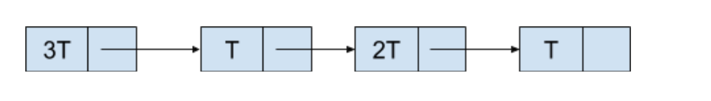
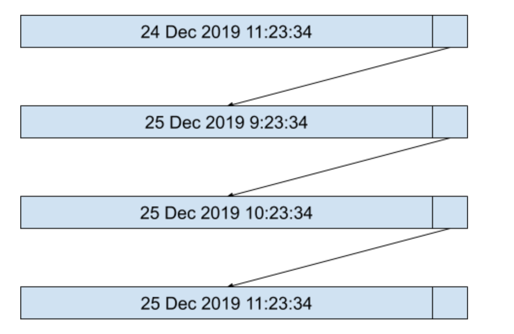
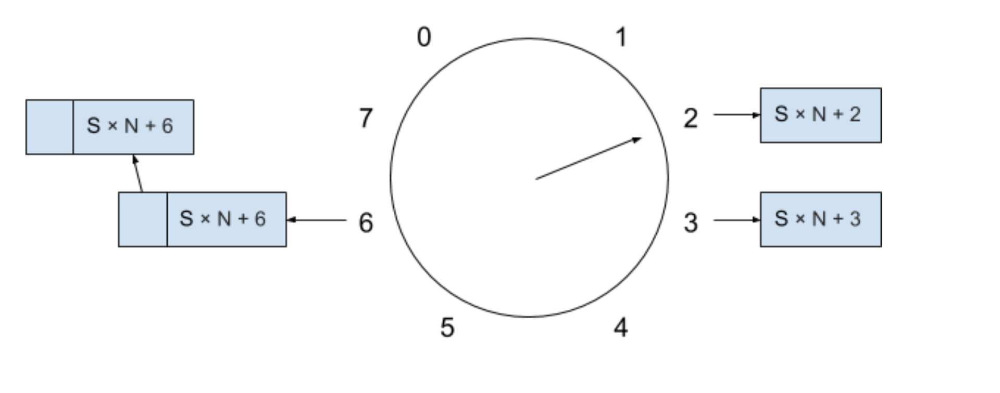

## 定时器基本概念抽象

* 初始化定时器
* 删除定时器
* 定时器超时进程
* 定时器检测进程

## 定时器的实现

### 无序定时器列表

> * 如何设计
> 
>   直接用数组或者链表来维护所有的定时器 --> 简单粗暴
>
> * 数组和链表如何选择？
>
>   在数组中插入一个新的元素所需要的时间复杂度是 O(N)，而在链表的结尾插入一个新的节点所需要的时间复杂度是 O(1)，So？ 选择链表
>
> * 如何执行？
>
>   每次经过 T 时间之后，定时器检测进程都会从头到尾扫描一遍这个链表，每扫描到一个节点的时候都会将里面的时间减去 T，
>   然后判断这个节点的值是否等于 0 了，如果等于 0 了，则表示这个定时器超时，执行定时器超时进程并删除定时器，如果不等于，
>   则继续扫描下一个节点。 
>
> * 优缺点
>   * 优点：
>       是定时器的插入和删除操作都只需要 O(1) 的时间。
>   * 缺点：是每次执行定时器检测进程的时间复杂度为 O(N)。如果定时器的数量还很小时还好，
>       如果当定时器有成百上千个的时候，定时器检测进程就会成为一个瓶颈了。

### 有序定时器列表
 
> 对无序定时器列表的改良， 每次插入一个新的定时器时， 从头遍历，将定时器超时时间按照从小到达的顺序插入到定时器列表中。
> 根据超时时间和当前系统时间算出一个绝对时间 NowTime + nT
> 
> 执行定时器检测进程和删除定时器的时间复杂度为 O(1)
> 
> 插入定时器的时间复杂度为 O(N)
 

 
### 定时器“时间轮”

*  “时间轮” （Timing-wheel）概念
> 一个用数组并且数组元素为链表的数据结构来维护的定时器列表，尝尝伴随溢出列表（Overflow List） 来维护那些无法在数组范围内表达的定时器，
> 基本的“时间轮”会将定时器的超时时间划分到不同的周期（Cycle）中去，数组的大小决定了一个周期的大小
* 时间轮基本变量
> * “时间轮” 的周期数，用 `S` 来表示
> * “时间轮” 的周期大小，用 `N` 来表示
> * “时间轮” 数组现在所指向的索引，用 `i` 来表示

> 

### “时间轮” 变种算法

> 基本的 “时间轮” 插入操作因为维护了一个衣橱列表导致定时器的插入操作无法做到 O(1) 的时间复杂度，为了实现 O(1) 时间复杂度的插入操作
>
> 在变种 “时间轮” 算法中，加入一个 "MaxInterval" 的限制，即我们定义的 “时间轮” 数组的大小
>
> 假设“时间轮”数组的大小为 N，对于任何需要新加入的定时器，如果超时时间小于 N 的话，则被允许加入到“时间轮”中，否则将不被允许加入
>
> 那么该种 “时间轮” 在定时器执行检测进程以及插入或者删除定时器的操作的时间复杂度都只有 O(1)
>
> 缺点： MaxInternal 很大，但是时间颗粒度很小的话， 会占用比较大的空间
> ex: 如果时间颗粒度是 1 秒，而 MaxInterval 是 1 天的话，则需要维护一个大小为 24 × 60 × 60 = 86400 的数组
 
### 分层 “时间轮”

 