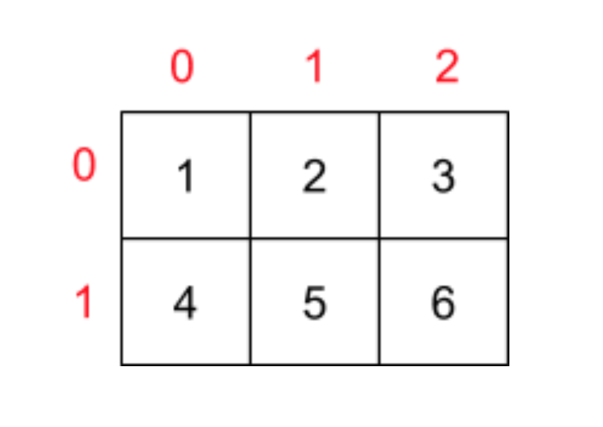
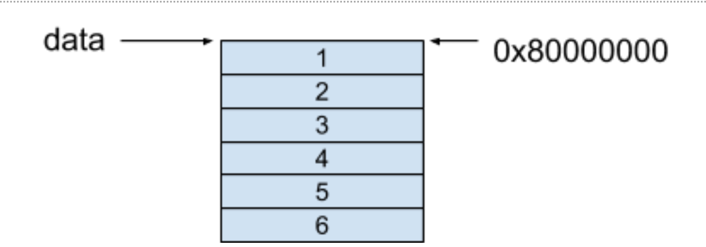
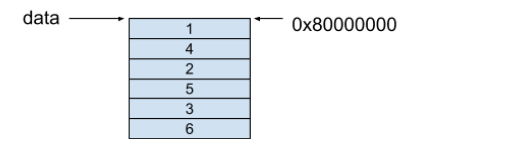

## 数组内存模型

> 数组可以被定义为是一组被保存在连续存储空间中，并且具有相同类型的数据元素集合，而数组中的每一个元素都可以通过自身的索引（Index）来进行访问。

### 一维数组

```
int[] data = new int[5];
```


这种分配连续空间的内存模型同时也揭示了数组在数据结构中的另外一个特性，即随机访问（Random Access）。随机访问这个概念在计算机科学中被定义为：可以用同等的时间访问到一组数据中的任意一个元素。


获取数组元素的方式是按照以下的公式进行获取的

```
base_address + index（索引）× data_size（数据类型大小）
```
索引在这里可以看作是一个偏移量（Offset）。

随机访问的背后原理其实也就是利用了这个公式达到了同等的时间访问到一组数据中的任意元素。

### 二维数组

```
int[][] data = new int[2][3];
```



> 在基于上面的二维数组声明的前提下，data[0][1] 这个元素的内存地址是多少呢? 不知道确认不了

* 二维数组在内存中的寻址方式

    * 行优先（Row-Major Order）
    
        行优先的内存模型保证了每一行的每个相邻元素都保存在了相邻的连续内存空间中，对于上面的例子，这个二维数组的内存模型如下图所示
    
    
    
    ```
        base_address + data_size × (i × number_of_column + j)
    ```
    
    * 列优先（Column-Major Order）
        列优先的内存模型保证了每一列的每个相邻元素都保存在了相邻的连续内存中，对于上面的例子，这个二维数组的内存模型如下图所示
        
    
    
    ```
        base_address + data_size × (i + number_of_row × j)
    ```

### 多维数组

```
int[][][] data = new int[2][3][4];
```

## 位数组（Bit Array）或者位图（Bit Map）

### 概念

> 将每个元素中的每一个比特位都作为状态信息存储的数组称之为位数组（Bit Array）或者位图（Bit Map）

