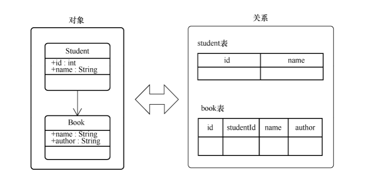
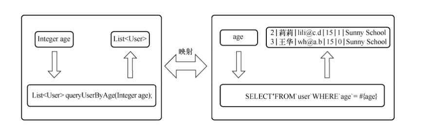

## 传统数据库连接

> * 第一步：加载驱动程序
> * 第二步：获得数据库连接
> * 第三步：创建语句并执行
> * 第四步：处理数据库操作结果
> * 第五步：关闭连接

## ORM 框架

> 对象与关系型数据库的转化
> 
>
> 对象关系映射（Object Relational Mapping，简称 ORM） 

## MyBatis 特点

> 核心功能： 将Java方法和 SQL语句关联起来，同时，MyBatis 将SQL语句的参数或者结果与对象关联
>
> & MyBatis 的映射机制
> 
>
> 其它功能：缓存，懒加载，主键自增，多数据集处理
>

## MyBatis 运行流程

> 大体流程

* 建立数据库的SqlSession
* 查找当前映射接口中抽象方法对应的数据库操作节点，根据该节点生成接口的实现
* 接口的实现拦截对映射接口中抽象方法的调用，并将其转化为数据查询操作
* 对数据库操作节点中的数据库操作语句进行多次处理，最终得到标准的SQL语句
* 尝试从缓存中查找操作结果，如果找到则返回；如果找不到则继续从数据库查询
* 从数据库中查询结果
* 处理结果集
    * 建立输出对象
    * 根据输出结果对数据对象的属性赋值
* 在缓存中记录数据查询结果
* 返回查询结果

