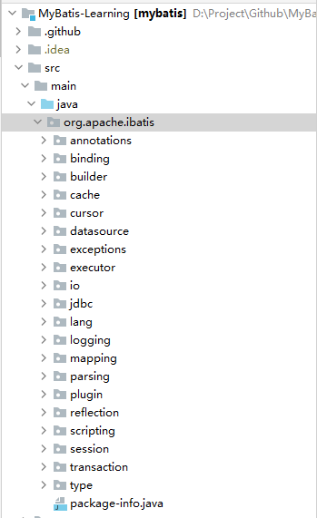
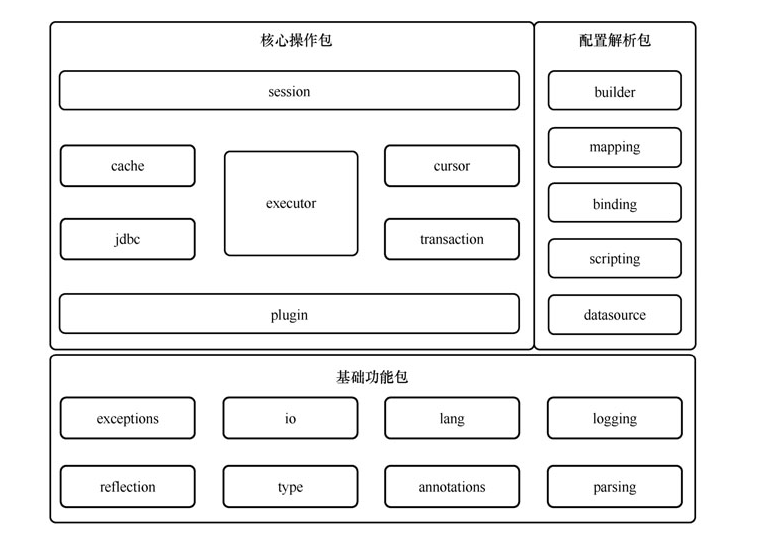

## MyBatis项目结构

> 按照功能分类： 

* 基础功能包: 为其它包提供一些外围基础功能，如文件读取功能、反射操作功能等。特点：功能相对独立，与业务逻辑耦合小
   > 基础功能包： exceptions, reflection, annotations, lang, type, io, logging, parsing
* 配置解析包：用来完成配置解析、存储等工作，主要在系统初始化阶段运行
   > 配置解析包： binding, builder, mapping, scripting, datasource
* 核心操作包: 用来完成数据库操作。在工作过程中，这些包会依赖基础功能包提供的基础功能和配置解析包提供的配置信息，主要在数据库操作阶段运行
   > 核心操作包：jdbc, cache, transaction, cursor, executor, session, plugin

                                                                         
                                                                      

