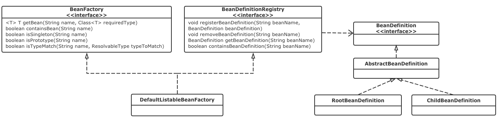
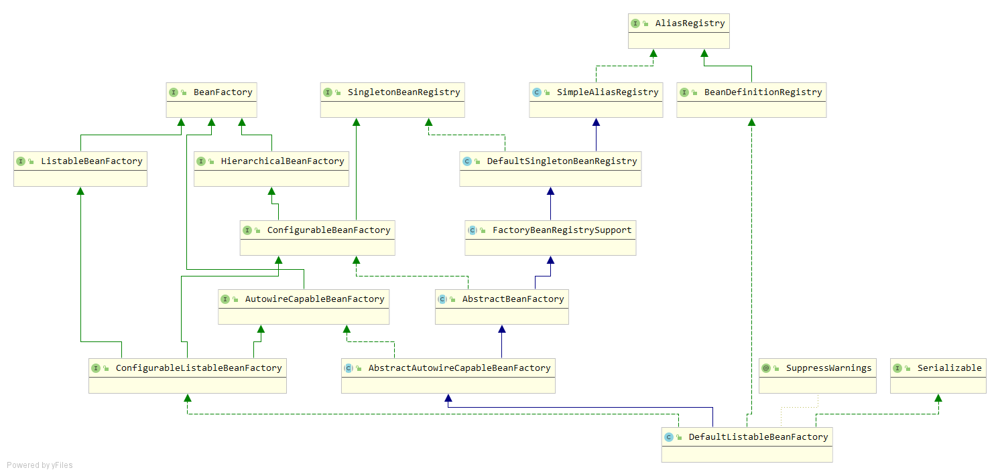

## Spring IoC容器基础元件

* `BeanDefinition`: 该实例负责保存bean对象的所有必要信息，包括bean对象的class类型、是否是抽象类、构造方法和参数、其它属性等等
* `BeanDefinitionRegistry`: 抽象出bean的注册逻辑, BeanDefinitionRegistry接口包含registerBeanDefinition、removeBeanDefinition、getBeanDefinition等注册管理BeanDefinition的方法
* `BeanFactory`: 抽象出了bean的管理逻辑, BeanFactory接口中主要包含getBean、containBean、getType、getAliases等管理bean的方法

    BeanFactory、BeanDefinitionRegistry关系图 如下：
    
    
    
* `DefaultListableBeanFactory`: 通用的BeanFactory实现，它同时也实现了BeanDefinitionRegistry接口，因此它就承担了Bean的注册管理工作

       
    
## Spring IoC容器的工作流程

1. 容器启动阶段（bean对象信息收集验证&其它）

> 容器启动时，会通过某些途径（代码|XML配置）加载 `MateData`（元配置数据），`BeanDefinitionReader` 会对加载的 `MateData` 进行解析和分析，
> 并将分析后的信息组装为响应的  `BeanDefinition`， 最后将 `BeanDefinition` 注册到相应的 `BeanDefinitionRegistry` 

2. Bean的实例化阶段  

> 当某个请求通过容器的 `getBean` 方法请求某个对象，或者因为依赖关系容器需要隐式调用 `getBean` 时，就会触发第二阶段的活动，容器会首先检查所请求的对象之前是否已经实例化完成。如果没有
> 则会根据注册的`BeanDefinition` 所提供的信息实例化被请求对象，并为其注入依赖，当该对象装配完毕后，容器会立即将其返回给请求方法使用

> `BeanFactory` 只是 Spring Ioc 容器的一种实现，如果没有特殊指定，它采用延迟初始化策略：只有当访问容器中的某个对象时，才对改对象进行初始化和依赖注入操作。
> `ApplicationContext` 容器在实际场景中使用更多，它构建在 `BeanFactory` 之上，属于更高级的容器。除了具有`BeanFactory`的所有能力之外，还提供对事件监听机制以及国际化的支持等。
> 它管理的bean, 在容器启动时全部完成初始化和依赖注入

## Spring容器扩展机制

* `BeanFactoryPostProcessor`: 允许我们在容器实例化相应对象之前，对注册到容器的BeanDefinition所保存的信息做一些额外的操作，比如修改bean定义的某些属性或者增加其他信息等。
* `BeanPostProcessor`: 存在于对象实例化阶段，处理容器内所有符合条件并且已经实例化后的对象

    ```java
    public interface BeanPostProcessor {
    
        // 前置处理
        @Nullable
        default Object postProcessBeforeInitialization(Object bean, String beanName) throws BeansException {
            return bean;
        }
    
        // 后置处理
        @Nullable
        default Object postProcessAfterInitialization(Object bean, String beanName) throws BeansException {
            return bean;
        }
    
    }
    ```
* Bean的实例化过程
   > postProcessBeforeInitialization()方法与postProcessAfterInitialization()分别对应图中前置处理和后置处理两个步骤将执行的方法。这两个方法中都传入了bean对象实例的引用，为扩展容器的对象实例化过程提供了很大便利，
   > 在这儿几乎可以对传入的实例执行任何操作
  
  

### 如何自定义扩展类

1. 实现 `org.springframework.beans.factory.config.BeanFactoryPostProcessor` 接口
2. 实现 `org.springframework.core.Ordered` 接口，保证 `BeanFactoryPostProcessor` 按照顺序执行