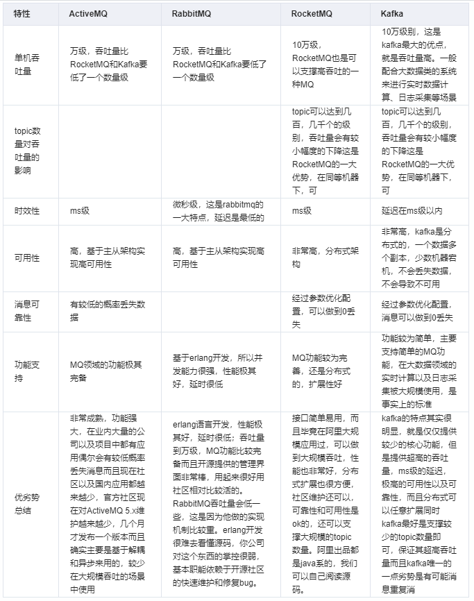

## MQ（消息中间件|消息引擎系统）

### 定义

根据维基百科的定义，消息引擎系统是一组规范。企业利用这组规范在不同系统之间传递语义准确的消息，实现松耦合的异步式数据传递。

* 消息引擎传输的对象是消息；
* 如何传输消息属于消息引擎设计机制的一部分。

消息队列中间件是分布式系统中重要的组件，是在消息的传输过程中保存消息的容器。

### 为什么使用（优点）

* 复杂系统的解耦与复用

> A 系统发送一条消息到多个系统，此时每增加一个系统，都需要 A 系统修改源码来适配，耦合度很高，引入消息中间件的话，只需要发送一次消息到消息队列，其它系统就可以复用该消息

* 复杂链路的异步调用

> 请求一个接口时，该接口可能同时调用其它方法，例如：注册操作，后台可能需要调用：数据库查询，发送邮件，发送短信，等等...整个流程同步等待的话，可能会很长很长...
> 但是，用户的耐心是有限的，这个时候，引入MQ，就可以很快收到请求响应，后台自己去做一些其它的事情了，mq的机制又能保证最终的一致性，所以使用起来很安全很稳定。

* 瞬时高峰的削峰处理

> 也就是说，当系统压力过大的时候，让系统压力减小
> 例如：平时的请求量是每秒几百，高峰期是 每秒几千上万，此时由于加入了消息队列，不会出现请求量激增导致系统崩溃

### 缺点

* 系统可用性降低（需要考虑MQ的高可用，消息丢失等问题）
* 系统复杂性提高（重复消费，消息丢失，消息传递的顺序性）
* 分布式一致性问题（数据不一致情况）

### 常见MQ区别

## MQ 相关概念

### 消息模型

#### 消息队列(点对点模型)

> 利用消息队列，解耦生产者和消费者；多个生产者可以发送消息到相同队列，一个消息被一个消费者处理之后，这个消息在队列上会被锁住或者被移除并且其他消费者无法处理该消息，也就是说一个具体的消息只能由一个消费者消费。
>
> 如果消费者处理一个消息失败了，消息系统一般会把这个消息放回队列，这样其他消费者可以继续处理。消息队列除了提供解耦功能之外，它还能够对生产者和消费者进行独立的伸缩（scale），以及提供对错误处理的容错能力。

#### 发布/订阅模型

> 发布/订阅（pub/sub）模式中，单个消息可以被多个订阅者并发的获取和处理。发送方也称为发布者（Publisher），接收方称为订阅者（Subscriber）
>
> 一个系统中产生的事件可以通过这种模式让发布者通知所有订阅者，在许多队列系统中常常用主题（topics）这个术语指代发布/订阅模式，在RabbitMQ中，主题就是发布/订阅模式的一种具体实现（更准确点说是交换器（exchange）的一种
>
> 一般来说，pub/sub 通常有两种模式
> * 临时（ephemeral）订阅，这种订阅只有在消费者启动并且运行的时候才存在。一旦消费者退出，相应的订阅以及尚未处理的消息就会丢失。
> * 持久（durable）订阅，这种订阅会一直存在，除非主动去删除。消费者退出后，消息系统会继续维护该订阅，并且后续消息可以被继续处理。

## 参考
* [消息队列（mq）是什么？](https://www.zhihu.com/question/54152397?sort=created)
* [RabbitMQ vs. Kafka: Head-To-Head](https://medium.com/better-programming/rabbitmq-vs-kafka-1779b5b70c41)
* [RabbitMQ vs. Kafka](https://medium.com/better-programming/rabbitmq-vs-kafka-1ef22a041793)
* [极客时间·Kafka核心技术与实战](https://time.geekbang.org/column/intro/191)
