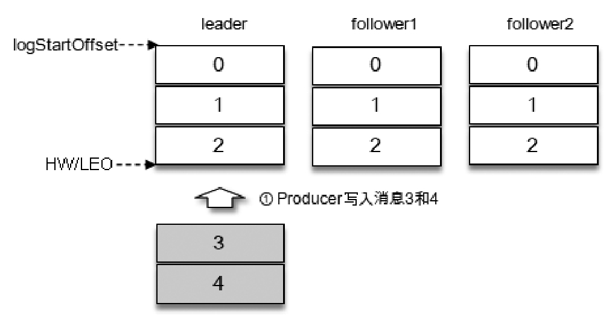
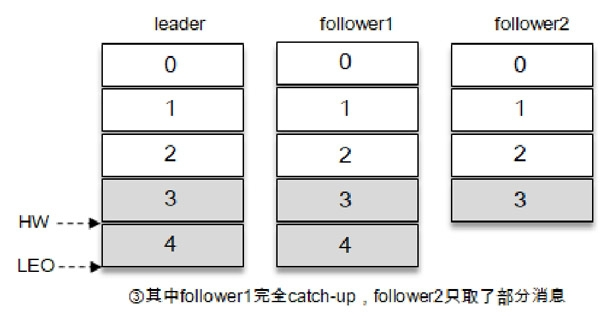
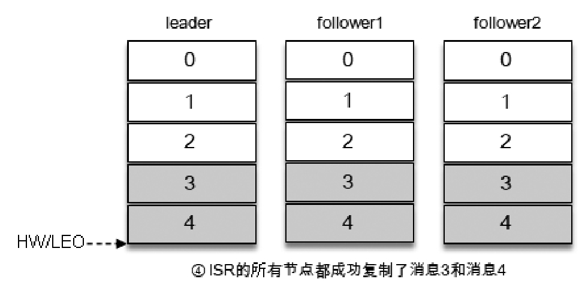
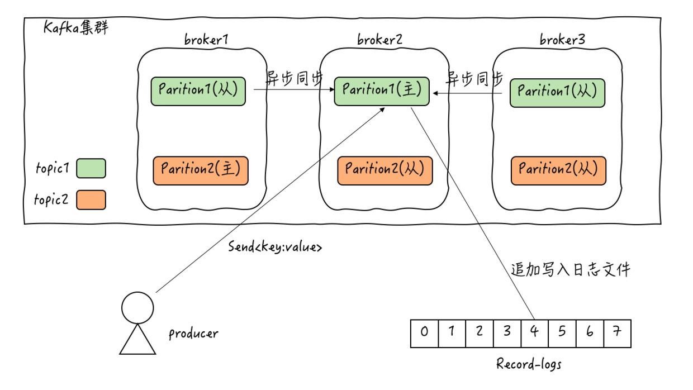

## 什么是Kafka

> Apache Kafka 是一款开源的消息引擎系统，也是一个分布式流处理平台。
> 根据维基百科的定义，消息引擎系统是一组规范。企业利用这组规范在不同系统之间传递语义准确的消息，实现松耦合的异步式数据传递。
> 通俗来讲，就是系统A发送消息给消息引擎系统，系统B从消息引擎系统中读取A发送的消息
>
> Kafka起初是由LinkedIn公司采用Scala语言开发的一个多分区、多副本且基于ZooKeeper协调的分布式消息系统，现已被捐献给Apache基金会。
> 目前Kafka已经定位为一个分布式流式处理平台，它以高吞吐、可持久化、可水平扩展、支持流数据处理等多种特性而被广泛使用。目前越来越多的开源分布式处理系统如Cloudera、Storm、Spark、Flink等都支持与Kafka集成。

## Kafka 设计之初三个特性

* 提供一套API实现生产者和消费者
* 降低网络传输和磁盘存储开销
* 实现高伸缩架构

## Kafka 扮演的角色

* 消息系统

> Kafka 和传统的消息系统（也称作消息中间件）都具备系统解耦、冗余存储、流量削峰、缓冲、异步通信、扩展性、可恢复性等功能。
> 与此同时，Kafka 还提供了大多数消息系统难以实现的消息顺序性保障及回溯消费的功能

* 存储系统

> Kafka 把消息持久化到磁盘，相比于其他基于内存存储的系统而言，有效地降低了数据丢失的风险。也正是得益于Kafka 的消息持久化功能和多副本机制，
> 我们可以把Kafka作为长期的数据存储系统来使用，只需要把对应的数据保留策略设置为“永久”或启用主题的日志压缩功能即可。

* 流式处理平台

> Kafka 不仅为每个流行的流式处理框架提供了可靠的数据来源，还提供了一个完整的流式处理类库，比如窗口、连接、变换和聚合等各类操作

## Kafka中的术语

* 消息：Record。指Kafka处理的主要对象
* 主题： Topic。主题是承载消息的逻辑容器，在实际使用中多用来区分具体的业务
* 分区：Partition。一个有序不变的消息序列。每个主题下可以有多个分区
* 消息位移：Offset。表示分区中每条消息的位置信息，是一个单调递增且不变的值
* 副本：Replica。Kafka中同一条消息能够被拷贝到多个地方以提供数据冗余，这些地方就是所谓的副本。副本还分为领导者副本（Leader Replica）和追随者副本（Follower Replica），各自有不同的角色划分。
    领导者副本能够对外与客户端程序进行交互，而追随者副本向领导者副本发送请求，请求领导者把最新的消息发送给它，保持与领导者的同步。副本是分区层级下的。即每个分区可配置多个副本实现高可用
* 生产者：Producer。向主题发布新消息的应用程序
* 消费者：Consumer。从主题订阅新消息的应用程序
* 消费者位移：Consumer Offset。表征消费者消费进度，每个消费者都有自己的消费者位移
* 消费者组：Consumer Group。多个消费者实例共同组成的一个组，同时消费多个分区以实现高吞吐
* 重平衡：Rebalance。消费者组内某个消费者实例挂掉后，其他消费者实例自动重新分配主题分区的过程。Rebalance 是Kafka 消费者端实现高可用的重要手段
* 图：
    
    
> 再说点别的吧--引申
> * AR(Assigned Replicas), 分区中的所有副本统称为AR
> * ISR(In-Sync Replicas), 所有与Leader 副本保持“一定程度同步”（可忍受的滞后范围）的副本（包括Leader副本在内）组成ISR，ISR集合是AR集合中的一个子集
> * OSR(Out-of-Sync Replicas)，与Leader副本同步之后过多的副本（不包括Leader副本）组成OSR
> * HW(Hith Watermark)，标识了一个特定的偏移量（offset），消费者只能拉取这个offset之前的消息
> * LEO(Log End Offset)，标识当前日志文件中下一条待写入消息的offset
> * 图示（图片源自《深入理解Kafka：核心设计与实践原理》一书）：
>  
> 
> 
> 
>

## Kafka 消息架构

* 主题层，每个主题可以配置M个分区，而每个分区又可以配置N个副本（注：topic只是一个逻辑容器，常用来区分不同的业务数据。）
* 分区层，每个分区的N个副本中只能有一个充当领导者角色，对外提供服务；其它N-1个副本是追随者副本，提供数据冗余
* 消息层，分区中包含若干条消息，每条消息的位移从0开始，依次递增
* 交互层，客户端只能与分区的领导者副本进行交互
* 一张图来表述一下吧
    

## Kafka版本

* 0.7: 只提供了最基础的消息队列的功能
* 0.8: 引入了副本的机制，保证了系统的可靠性，此时kafka使用的还是老版本的客户端api，需要指定zookeeper地址，0.8.2引入了新版本的producer，但是bug较多。
* 0.9: 引入了增加了基础的安全认证/权限功能, 同时还引入了kakfa connect组件，使用了java语言重写了新版 consumer api，从这个版本开始,新版producer api相对稳定。
* 0.10: 引入了kafka stream 使得kafka正式升级成为了分布式流处理平台，这个版本的consumer api开始相对稳定，0.10.22修复了可能会降低producer性能的bug，如果你使用的是这个版本的kafka，建议升级为0.10.22
* 0.11: 提供幂等性 Producer API 以及事务（Transaction） API，这个版本的kafka消息进行了重构，由v1升级成了v2，提高了压缩的程度和效率。
* 1.0/2.0: 主要是对kafka Stream进行改进和优化

## Kafka的参数(整理项，选读)

### broker
* log.dirs:指定了broker使用的若干文件路径。
* listeners:监听器，告诉外部连接者通过什么协议访问指定名称和端口的kafka服务
* advertised.listeners:和listeners功能一致，不同的是它是对外部发布的
* auto.create.topics.enable:是否允许自动创建topic
* unclean.leader.election.enable:是否允许unclean的leader进行选举
* auto.leader.rebalance.enabl:是否允许定期举行leader选举
* log.retention.{hours|minutes|ms}:消息被保存的时间
* message.max.bytes:broker最大能接收消息的大小
* replica.lag.time.max.ms:follower副本可以落后leader副本的最长时间间隔。
### topic

* retention.ms:该topic中消息被保存的时间
* max.message.bytes:该topic最大能接收的消息大小
* replication.factor:消息冗余份数

### producer

* bootstrap.server:用于与kafka集群中的broker创建连接，只需要配置部分broker即可
* key.serializer/value.serializer:键/值的序列化方式，必填
* acks:非常重要，用于控制producer产生消息的持久性，kafka只对“已提交”的消息做有有限度的持久化保证。而这个参数，就是定义“已提交”。
* acks = 0:producer不用理睬broker端的处理结果，只要消息发送后，就认为是“已提交”
* acks = all或-1,不仅leader broker要将消息写入本地日志，还要ISR集合中的所有副本都成功写入各自的本地日志后，才发送响应消息给producer，认为消息“已提交”
* acks = 1折中方案，当leader broker将消息写入本地日志，就返回响应给producer，认为消息“已提交”
* min.insync.replica:消息至少要被写入多少个副本，才算写入成功，这个参数和acks功能类似，不过它强调的是个，acks = all时，强调的是所有副本。(比如ISR中只有一个replica，那么配置acks = 1即写入一个broker即可，min.sync.replica = 2，即需要写入2个broker，这条消息会写入失败)
* buffer.memory:指定了producer端用于缓存消息的缓冲区大小。kafka发送消息采用的是异步架构的方式，消息写入缓冲区，由一个专属线程从缓冲区中获取消息，执行真正的发送
* compression.type:producer端压缩方式，压缩可以节省网络传输中的带宽，牺牲CPU使用率
* retries:失败后的重试次数，非常重要的参数，用于实现kafka的处理语义
* retries = 0，即失败后不会进行重试，实现至多一次的处理语义
* retries = n，即失败后会重试n次，实现至少一次的处理语义
* (kafka 0.11后推出了精确一次的处理语义，即幂等性producer以及事务，相关参数：enable.idempotence = true)
* bacth.size:producer会将发往同一分区的消息，打成一个batch，当batch满了后，producer会一次发送batch中的所有消息，这个参数控制者batch的大小。
* linger.ms:上面提到的batch，在batch没满的时候，也会进行发送，这其实是一种权衡，权衡的是吞吐量和消息延时，linger.ms控制的就是消息的延时行为，默认值是0，表示消息会被立即发送，不管batch是否装满，我们可以改变这个参数，来修改发送消息的时间，即一条消息是否会被发送，取决于1、batch是否装满；2、有没有达到linger.ms规定的时间。
* max.request.size:控制producer端最大可以发送消息的大小。
* request.timeout.ms:当producer发送消息给broker后，broker需要在指定时间内返回响应，否则producer就会认为该请求超时，并显示抛出TimeoutException。

### consumer

* bootstrap.server:用于与kafka集群中的broker创建连接，只需要配置部分broker即可
* key.deserializer/value.deserializer:键/值的反序列化方式，必填
* group.id:consumer group的名字，必填
* session.time.out:coordinator检测到consumer失活的时间，这个值设置的较小有利于coordinator更快的检测consumer失活。
* max.poll.interval.ms:consumer处理逻辑的最大时间，如果一次poll()超过了这个时间，则coordinator会认为该consumer已经不可用，会将其踢出消费者组并进行重平衡。
* auto.offset.reset:制定了无位移或位移越界时,kafka的对应策略。取值：earliest:从最早位移进行消费、laster:从最新位移开始消费、none：抛出异常。
* auto.commit.enable:指定consumer是否自定义提交位移
* fetch.max.bytes:consumer端单次获取数据的最大字节数
* max.poll.records:单次poll()返回的最大消息数
* heartbeat.interval.ms:心跳请求频率
* connections.max.idle.ms:定期关闭空闲的tcp连接。

## 参考
* 《深入理解Kafka：核心设计与实践原理》
* [极客时间《Kafka核心技术与实战》专栏](https://time.geekbang.org/column/intro/191?code=BtFEondYeuW5WpsmDPOUBZ-ITYntRB05Q0JHtsbhDlI%3D&utm_term=SPoster)

