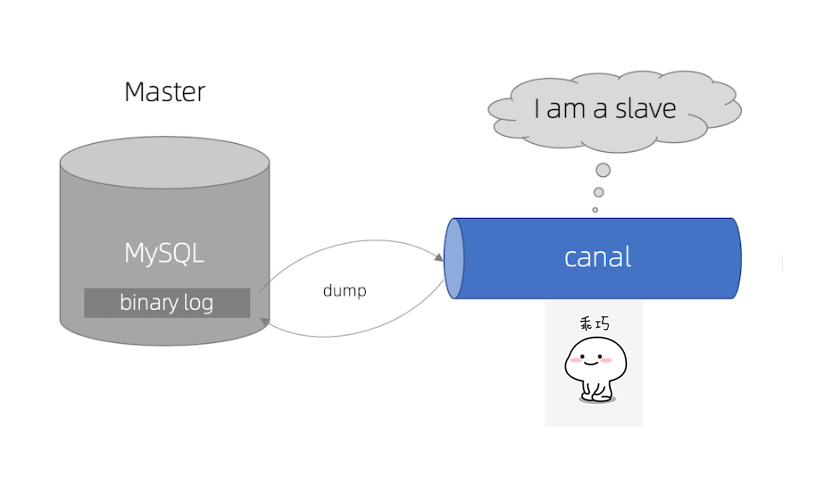

# Canal 简介

> [canal](https://github.com/alibaba/canal) 是阿里巴巴开源的mysql数据库 binlog 增量订阅和消费组件
>


# 工作原理

## MySQL主备复制原理


* MySQL master 将数据变更写入二进制日志( binary log, 其中记录叫做二进制日志事件binary log events，可以通过 show binlog events 进行查看)
* MySQL slave 将 master 的 binary log events 拷贝到它的中继日志(relay log)
* MySQL slave 重放 relay log 中事件，将数据变更反映它自己的数据

emmm... 基于MySQL的数据同步机制，Canal 巧妙的诞生了...

## canal 工作原理



* canal 模拟 MySQL slave 的交互协议，伪装自己为 MySQL slave ，向 MySQL master 发送dump 协议
* MySQL master 收到 dump 请求，开始推送 binary log 给 slave (即 canal )
* canal 解析 binary log 对象(原始为 byte 流)

### binlog 介绍

[binlog 介绍](docs/db/mysql/binlog介绍.md)

### `重要前置条件`

* 对于自建 MySQL , 需要先开启 Binlog 写入功能，配置 binlog-format 为 ROW 模式，my.cnf 中配置如下

```
[mysqld]
log-bin=mysql-bin # 开启 binlog
binlog-format=ROW # 选择 ROW 模式
server_id=1 # 配置 MySQL replaction 需要定义，不要和 canal 的 slaveId 重复
```

* 授权 canal 链接 MySQL 账号具有作为 MySQL slave 的权限, 如果已有账户可直接 grant

```sql
CREATE USER canal IDENTIFIED BY 'canal';  
GRANT SELECT, REPLICATION SLAVE, REPLICATION CLIENT ON *.* TO 'canal'@'%';
-- GRANT ALL PRIVILEGES ON *.* TO 'canal'@'%' ;
FLUSH PRIVILEGES;
```
## How to Use 

#### [QuickStart](https://github.com/alibaba/canal/wiki/QuickStart)
#### [Docker QuickStart](https://github.com/alibaba/canal/wiki/Docker-QuickStart)
#### [Canal Admin QuickStart](https://github.com/alibaba/canal/wiki/Canal-Admin-QuickStart)

## 整体设计


* server 代表一个 canal 运行实例，对应于一个 jvm
* instance 对应于一个数据队列 （1个 canal server 对应 1..n 个 instance )
    > [Canal Instance 详情](Canal%20Instance.md)
